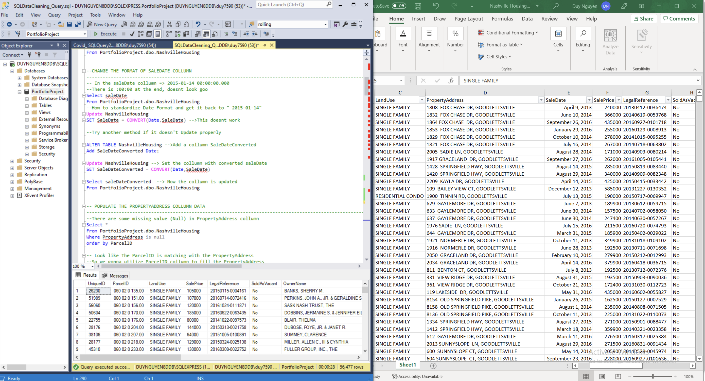
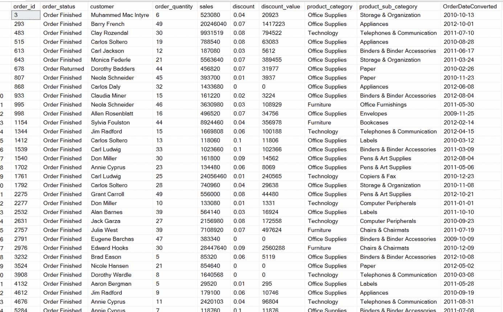
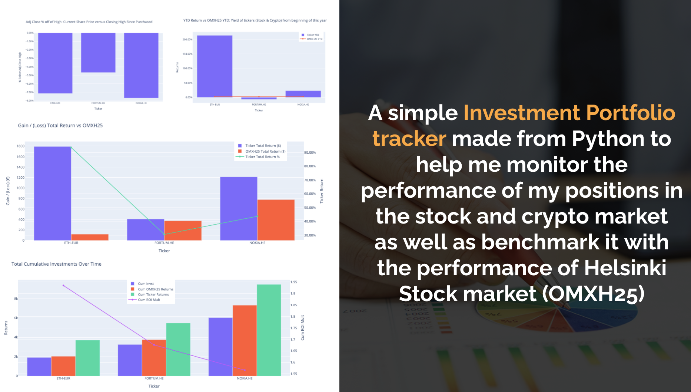

# Portfolio

## SQL & Dasboard/BI (Tableau & Power BI)

---
### Hotel Revenue Analysis using SQL Server and Reprot with Power BI

<iframe title="HotelRevenue - Page 1" width="600" height="373.5" src="https://app.powerbi.com/view?r=eyJrIjoiYzFmZTBlYjUtOTYwMS00MjgzLThhZDAtNjk0ZDAyZGEzOWVjIiwidCI6ImZhNjk0NGFmLWNjN2MtNGNkOC05MTU0LWMwMTEzMjc5ODkxMCIsImMiOjl9" frameborder="0" allowFullScreen="true"></iframe>

  

 
This is a small project for me to learn using Power BI and build a dashboard. 

 
The data set demonstrate the transactions of 2 hotels (City Hotel and Resort Hotel) with the average daily rate (ADR) measures the average rental revenue earned for an occupied room per day. The dataset consits all transactions of these hotel from 2018-2019-2020. The dataset also provide the info in the parking spaces required and the actual parking percentage over the total revenue. The project goes through 4 small steps: 

  <ul>
  <li>1. Build a Database: By Import Excel data of Hotel Revenue into a database in SQL Server Management Studio</li>
  <li>2. Analyze and Retrieve Data with SQL: Uisng different SQL commands to retrieve the necessary data</li>
  <li>3. Connect Power BI to a Database: Using Power to connect to the data base and extract the data with a custom SQL query in Power BI</li>
  <li>4. Visualize Data in Power BI</li>

</ul>  
Find the dataset here: https://github.com/duy7590/SQL-Practice-Projects/blob/main/Hote%20Revenue/hotel_revenue_historical_full.xlsx

---

---
### A dashboard to summarize the Covid Infections 

This is a project for me to practice SQL and Tableau and demonstrate the the basic skills to provide some intelligence out of the raw data.
  
For SQL, I used Microsoft SQL Server Management Studio to create a database based on the Covid Data Excel dowloaded from https://ourworldindata.org/coronavirus
Then I setup different tables and play around with different querries before export the final cleaned dataset and take it as an input to Tableau
  
In Tableau, I made a range of different charts based on the data querried from SQL. (Check it <a href="https://github.com/duy7590/SQL_Covid19_Tutorial/blob/main/Covid19_Data%20Exploration_%20SQLQuery.sql"> here</a> ) 
Later, I designed a simple Dashboard in Tableau which could be view from <a href="https://public.tableau.com/app/profile/duy.nguyen1086/viz/CovidDashboard_16429782005130/Dashboard1"> here</a>: 

<object class='tableauViz'  style='display:none;'><param name='host_url' value='https%3A%2F%2Fpublic.tableau.com%2F' /> <param name='embed_code_version' value='3' /> <param name='site_root' value='' /><param name='name' value='CovidDashboard_16429782005130&#47;Dashboard1' /><param name='tabs' value='no' /><param name='toolbar' value='yes' /><param name='animate_transition' value='yes' /><param name='display_static_image' value='yes' /><param name='display_spinner' value='yes' /><param name='display_overlay' value='yes' /><param name='display_count' value='yes' /><param name='language' value='en-US' /></object>
                

---
### A dashboard to analyze the state of Education Technology in Europe and North America 

This project I utilize the data from Pitchbook, a financial software and data provider helping investment professionals capitalize on opportunities within the private and public markets. In this project, I get the venture capital investment into Edutech companies which located in North America and Europe and founded after 2010 ( In order to reach more innovative, up-to-date and specialized solutions  instead of traditional companies. This is due to the fact that most of the venture capital activities in the  field for educational technologies started to gain traction since 2010. It is with high confidence that 2010 is a good border to frame the research. )
 
<ul>
Some key takeaways:
  <li> Despite the unstable market climate in 2020, the investment activities into this field have still increased significantly.</li>
  <li> The Investment activity in North America is much more active than that of European market. The amount of VC funding in North America is almost 4x the amount in Europe during the past 10 years.</li>
  <li> Most recurring keywords being mentioned in those emerging companies are around "Online platform, Student management, Digital Course, Game App, Language Skills, Career" </li
  <li> B2C service providers is the biggest group on the market. However, Corporation training and virtual class room apps are also emerging </li
  <li> Most active sources of investments in the field are accelerator and incubator and Venture Capital. </li>
  <li> Over 50% of deals are made into early stage or seeding stage companies. This indicates the fact that the field is still pretty much active market and open to new tech developers. Public and accelerator fundings typically support more early stage-solutions, whereas Private Equity and M&A-investments are associated with more mature companies.</li>
</ul> 
 
  

<object class='tableauViz'  style='display:none;'><param name='host_url' value='https%3A%2F%2Fpublic.tableau.com%2F' /> <param name='embed_code_version' value='3' /> <param name='site_root' value='' /><param name='name' value='EduTech&#47;Dashboard1' /><param name='tabs' value='no' /><param name='toolbar' value='yes' /><param name='animate_transition' value='yes' /><param name='display_static_image' value='yes' /><param name='display_spinner' value='yes' /><param name='display_overlay' value='yes' /><param name='display_count' value='yes' /><param name='language' value='en-US' /><param name='filter' value='publish=yes' /></object>
                

---

### Data Cleaning Practice with Microsoft SQL Server Management Studio using Housing Dataset

This is a practice for me to practice data cleaning and processing with SQL querries 
I used Microsoft SQL Server Management Studio and the "Nashville Housing Dataset" for this Data Cleaning Practice. (Check it <a href="https://github.com/duy7590/SQL-Practice-Projects/blob/main/Nashville%20Housing%20Data%20for%20Data%20Cleaning.xls"> here</a> ) 

  

---
### Data Query Practice with Microsoft SQL Server Management Studio using Retail Sales Report of DLABSTORE

This project provided by DQLab, here was given the dataset contains the transactions report from 2009 until 2012 consist 5500 rows. 
(The dataset can be found here <a href="https://github.com/duy7590/SQL-Practice-Projects/blob/main/Sales%20Performance%20Report%20DQLab%20Store/clean_data.csv"> here</a> ) 

I uses the dataset to answer 6 different business questions as below:
<ul>
  <li>Order numbers and total sales from 2009 until 2012 which order status is finished</li>
  <li>Total sales for each sub-category of product on 2011 and 2012</li>
  <li>The effectiveness and efficiency of promotions carried out so far, by calculating the burn rate of the overall promotions by year</li>
  <li>The effectiveness and efficiency of promotions carried out so far, by calculating the burn rate of the overall promotions by sub-category of product on 2012</li>
  <li>The number of customers transactions for each year</li>
  <li>The number of new customers for each year </li>
  
</ul>  

---

## Recommender system 
---
### Movies recommender system for group of users (not individual user) with different profiles

This is projects done in my "Recommender system" course at University of Tampere. The recommender systems aim at suggesting to users items of potential
interest to them. There are quite different approaches for this task. However, there are 2 basic methods when recommending a new item to user:
  • Similar users - user-based collaborative filtering: Make suggestions based on preferences of similar users 
      - Given a user, identify his/her k most similar users: Cosine similarity, Jaccard similarity
      - Produce recommendations based on the items that are liked by those k users: avg ratings, weighted schemes
  • Similar items - item-based collaborative filtering: Exploit relationships between items
      - Compute similarities between items: Cosine similarity, Jaccard similarity
      - Keep for each item only the k most similar items along with their similarity scores
      - Use similarities to calculate ratings for items with no scores 
  
Recommenders are usually designed to provide recommendations adapted to the preferences of a single user. In many situations the recommended items
are consumed by a group of users. However, in this project, we want to address this issue and bring the Recommender system to another level.

First of all, we run the model with 2 method of Group Recommender system:Average method & Least misery method. The basic idea of these 2 method is to produce a Representative Profile from the the group of different user' profiles.

However, there are weaknesses in both average and least misery methods 
• Average method: the out-flier user is never satisfied
• Least misery method: the system recommends movies not highly interested by anyone in the group

Another important drawback/assumption for the Group recommender based on these 2 method is that:  each time a group is using the recommender system is distinct from the previous ones. This is not a good system.

So, the last step we implemented is using the Sequential Group Recommendations.The idea of Sequential Group Recommendations is: To get a better compromise of getting all group members satisfied enough, and taking into account the opinion of the possible disagreeing member.

For more detail of the implementation, please check the notebook file

---

## Data visualization

### Stock & Crypto Portfolio Performance 

This project has been done based on my real experience with the investment in stock market and crypto market.

During the period of 2018-2019, i have researched about Blockchain technology and learn about its tremendous pontential in the new age of technology. One of the best things about the blockchain is that, because it is a decentralized system that exists between all permitted parties, there’s no need to rely onintermediaries (Middlemen). Apart from its payment feature, the most important usecase of Crypto is smart contracts, otherwise called self-executing contracts, blockchain contracts, or digital contracts. smart contracts not only define the rules and penalties around an agreement in the same way that a traditional contract does, but also automatically enforce those obligations.

Seeing its potential in the future, I decided to invest in a small amount of Ethereum, one of the 2 most popular crypto in the market right now besides Bitcoin.

During the beginning of 2020, due to the Covid pandemic, investor's fear of economic crisis had resulted in a big crash in the global stock market as well in Finland. At this point I considered the stock values in OMX Helsinki Stock Exchange had been significantly undervalued. As a resulted, I decided to investment in 2 top shares in OMX (based on Market Capitalization) which are NOKIA and FORTUM.

This project has been done to visualize the gain and loss of my 3 positions in Crypto (Ethereum) and Stocks (Nokia and Fortum). As well as compare their performance with ther performance of OMX Index during the same period.

My Entry was as below:
<table style="height: 242px;" width="697">
<tbody>
<tr>
<td style="width: 139px;">Acquisition Date</td>
<td style="width: 139px;">&nbsp;Ticker</td>
<td style="width: 139px;">Quantity</td>
<td style="width: 139px;">Unit Cost &euro;&nbsp;</td>
<td style="width: 140px;">&nbsp;Cost Basis &euro;</td>
</tr>
<tr>
<td style="width: 139px;">&nbsp;03/31/20&nbsp;</td>
<td style="width: 139px;">&nbsp;NOKIA.HE</td>
<td style="width: 139px;">1000&nbsp;</td>
<td style="width: 139px;">&nbsp;2.78</td>
<td style="width: 140px;">&nbsp;2780</td>
</tr>
<tr>
<td style="width: 139px;">&nbsp;03/31/20&nbsp;</td>
<td style="width: 139px;">FORTUM.HE&nbsp;</td>
<td style="width: 139px;">&nbsp;100</td>
<td style="width: 139px;">&nbsp;13.4</td>
<td style="width: 140px;">1340</td>
</tr>
<tr>
<td style="width: 139px;">09/16/19&nbsp;</td>
<td style="width: 139px;">&nbsp;ETH-EUR</td>
<td style="width: 139px;">&nbsp;10</td>
<td style="width: 139px;">191.98&nbsp;</td>
<td style="width: 140px;">&nbsp;1919.8</td>
</tr>
</tbody>
</table>
<!-- DivTable.com -->

---
### GLOBAL SITUATION OF COVID-19

Within months, COVID-19 went from an epidemic to a pandemic. From the first identified case in December 2019, how did the virus spread so fast and widely? The spread of disease is a real concern for a world in which global travel is commonplace.
Aware of the serious situation, with this quick project I will build a mini dashboard to quickly update the global situation across the globe provided open data and using open source libraries.
https://towardsdatascience.com/@nik.piepenbreier 
I’ll be using data from this wonderful Github repository that auto-updates the data daily. I’ll load our data into a Pandas’ dataframe based on the URL so that it’ll update automatically for us every day.

---
## Data Science

### Bayesian Data Analysis

### DR. SEMMELWEIS AND THE DISCOVERY OF HANDWASHING

In this notebook, we're going to reanalyze the data that made Semmelweis discover the importance of handwashing. Let's start by looking at the data that made Semmelweis realize that something was wrong with the procedures at Vienna General Hospital.

---

## Master Thesis

### DETERMINANTS OF PROFITABILITY IN COMMERCIAL BANKS: CASE OF VIETNAM

This is my Master Thesis done for the Topic of Commercial Banking System in Faculty of Management, University of Tampere in 20217 as part of my research in the Master Program of Business Competence

                                                                                                                               

                                                                                                                               

Abstract: The financial system of Vietnam’s economy considers the banking system as the engine for its development and the growth of economy just like other countries in the world. Similar to most other private sectors, in order to sustain and develop the business, commercial banks need to earn and maintain positive and growing profitability. However, in the volatile business environment and during the economic transitional stage, banking sector tends to suffer unstable profitability and declining performance. Therefore, this research is carried out with the purpose to investigate which factors are the key determinants or driver of the profitability of commercial banks in Vietnam in the past 10 years. By reviewing prior studies and evidence from different countries and regions in the world, this research is going to supplement the current studies in Vietnam with a more potential factors that can potentially drive the profitability of local banking sectors. Internal factors such as financing structure, assets structure, asset quality, capitalization, operating efficiency, size of bank and income diversification will be studied in relation with profitability. Besides internal factors, external or macro-economic factors such as GDP growth rate, inflation rate and market concentration are also taken in to evaluation. This research contributes to existing literature by introducing the role diversification, nonperforming loans, operating efficiency and banking sector concentration level in the context of Vietnam. Multiple linear regression for balance panel data will be employed to serve the purpose of this research. Data includes 16 largest banks in Vietnam during the period of 10 years from 2007 to 2016. The outcomes are relatively mixed. While it suggests the significant effect of market concentration level, the importance of capitalization, the ability to manage the banks effectively and control non-performing loans, there is not enough evidence to support the benefit of income diversification. Besides, the loans level and bank size are found to be not relevant in the context of Vietnam.

© 2020 Duy Nguyen. Powered by Jekyll and the Minimal Theme.

