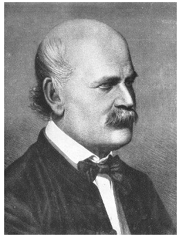

# Portfolio
---
## Data Science

### DR. SEMMELWEIS AND THE DISCOVERY OF HANDWASHING

In this notebook, we're going to reanalyze the data that made Semmelweis discover the importance of handwashing. Let's start by looking at the data that made Semmelweis realize that something was wrong with the procedures at Vienna General Hospital.

 

<right></right>
 
---

© 2020 Duy Nguyen. Powered by Jekyll and the Minimal Theme.

